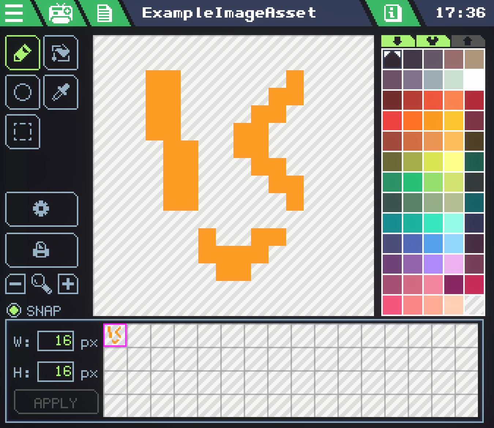

# VideoChip


The Video Chip represents the canvas of its connected screens, and is used to draw to them.

## Properties

### Mode - `VideoChipMode`
*"The SingleBuffer/DoubleBuffer mode for this VideoChip."*, whatever that means.

### Height - `number` **[Read only]**
Height in pixels of the rendering buffer. The area takes in account all the displays connected to this VideoChip.

### Width - `number` **[Read only]**
WIdth in pixels of the rendering buffer. The area takes in account all the displays connected to this VideoChip.

## Methods

### Clear(color `color`)
Clears all the render area with the specified **color**. Usually used before drawing each frame.
```lua
local video:VideoChip = gdt.VideoChip0

function update()
	video:Clear(color.white)
	-- <...>
end
```

## SetPixel(position `vec2`, color `color`)
Sets the pixel at the specified position to the specified **color**.


### DrawPointGrid(gridOffset `vec2`, dotsDistance `number`, color `color`)
Draws a dotted grid on the **entire display area**, with an offset. The dotsDistance parameter express the distance in pixels, on both axis, between dots. This is a strange function, but can be uses for backgrounds.
```lua
local video:VideoChip = gdt.VideoChip0

function update()
	video:Clear(color.blue)
	video:DrawPointGrid(vec2(0,3), 3, color.white)
end
```

### DrawLine(start `vec2`, end `vec2`, color `color`)
Draws a line from position start to position end, using the specified color.

### DrawCircle(position `vec2`, radius `number`, color `color`)
Draws an empty circle at the specified position, with the specified radius, in the specified color.

### FillCircle(position `vec2`, radius `number`, color `color`)
Draws a filled circle at the specified position, with the specified radius, in the specified color.

### DrawRect(position1 `vec2`, position2 `vec2`, color `color`)
Draws an empty rect from position1 to position2, in the specified color.

### FillRect(position1 `vec2`, position2 `vec2`, color `color`)
Draws a filled rect from position1 to position2, in the specified color.

### DrawTriangle(position1 `vec2`, position2 `vec2`, position3 `vec2`, color `color`)
Draws an empty triangle with vertices in position1, position2 and position3, in the specified color.

### FillTriangle(position1 `vec2`, position2 `vec2`, position3 `vec2`, color `color`)
Draws a filled triangle with vertices in position1, position2 and position3, in the specified color.


### DrawSprite(position `vec2`, spriteSheet `SpriteSheet`, spriteX `number`, spriteY `number`, tintColor `color`, backgroundColor `color`)
Draws a specific sprite frame from the spriteSheet. **Position** is for the position on the screen. **SpriteSheet** is a `SpriteSheet` loaded from assets. **SpriteX** and **Y** determine the offset for which sprite to draw, based on the zoom grid in the editor **(not pixels)**. **TintColor** allows you to multiply the sprite color (set to `color.white` to draw the sprite as-is). **BackgroundColor** can be set to transparent (`color.clear`) to keep transparency.
```lua
-- Assets
local spriteSheet:SpriteSheet = GetSpriteSheet("ExampleImageAsset")

-- Hardware
local video:VideoChip = gdt.VideoChip0

-- Update
function update()
	video:Clear(color.white)
	video:DrawSprite(vec2(5,5), spriteSheet, 0, 0, color.white, color.clear)
end
```



### DrawText(position `vec2`, fontSprite `SpriteSheet`, text `string`, textColor `color`, backgroundColor `color`)
Writes **text** to the canvas, using the only valid font: `local spriteFont = GetSpriteSheet("Builtin/StandardFont")`
```lua
-- Assets
local spriteFont = GetSpriteSheet("Builtin/StandardFont")

-- Hardware
local video:VideoChip = gdt.VideoChip0

-- Update
function update()
	video:Clear(color.black)
	video:DrawText(vec2(5,5), spriteFont, "Hello!", color.yellow, color.clear)
end
```


### RasterSprite(position1 `vec2`, position2 `vec2`, position3 `vec2`, position4 `vec2`, spriteSheet `SpriteSheet`, spriteX `number`, spriteY `number`, tintColor `color`, backgroundColor `color` )
Draws **an entire sprite sheet** mapping it on a quad identified by position1, position2, position3, position4.

### DrawRenderBuffer(position `vec2`, renderBuffer `RenderBuffer`, width `number`, height `number`)
Draws a render buffer (supposedly coming from **Webcam** component) at the desired position, width and height.


## Remarks

### Related types

#### `vec2`
vec2 is a two dimensional vector, usually used to point to screen coordinates. Basically a single value that represents two numbers. You can make a new vec2 easily, and then access its properties with `x` and `y`.
```lua
local pos:vec2 = vec2(20,10)
log(tostring(pos.X)) --20
log(tostring(pos.Y)) --10
```
`vec2(0,0)` is the top left corner of the canvas.

There is also vec3, but it is not usually used for screens. You may use it for organization.

#### `color`
`color` represents a color, and is used for LEDs or for drawing to the screen. You may construct a color in a few ways.
```lua
Color(r, g, b) --Values 0-255
ColorRGBA(r, g, b, a) --Alpha is also 0-255, 0 is transparent
ColorHSV(h, s, v) --Hue is 0-360, the other values are 0-100
```
There are a few built in colors, such as `color.blue` or `color.black`. In the future, these will be listed in a dedicated page for `color`.

You may access `R`, `G`, `B`, and `A` on a `color`.

#### `SpriteSheet`
See `DrawSprite(...)`

### Example project
The built-in **RasterBoy** gadget is great to get a better understanding of how graphics work. 