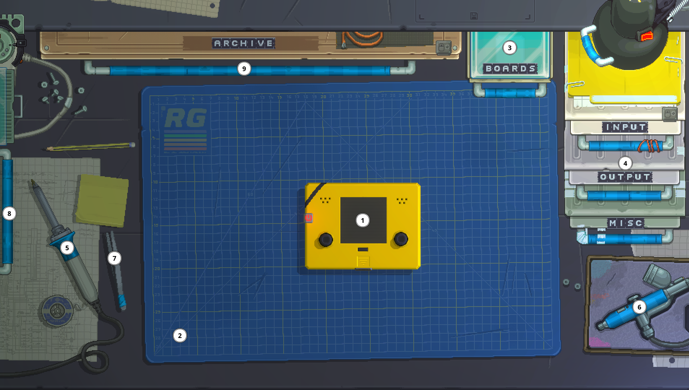

# Introduction to your Retro Desk
Retro Gadgets takes place in, well... on a Retro Desk!  
The Retro Desk has **2 modes**: MultiTool Mode and Building Mode.

## Building Mode

<table>
	<tr>
		<td>
			<b>1. Your ✨ Amazing ✨ Gadget</b> 
			Your gadget is the main attraction of your desk. It's what you have to be building, testing and playing around with in this game.
   		</td>
		<td>
			<b>2. Gadget Mat</b> 
			This is your building area, feel free to
			fiddle around with your gadget here!
   		</td>
		<td>
			<b>3. The Boards' Drawer</b> 
			Here you can find all the boards (basic shapes) that you can use to build your gadget.
		</td>
	</tr>
	<tr>
		<td>
			<b>4. Component Drawers</b> 
			Here you can find 3 drawers, each containing different types of components.
			<!-- TODO: add links to the components -->
		</td>
		<td>
			<b>5. The Soldering Iron</b> 
			You can use the soldering iron to solder
			your gadget's boards together.
		</td>
		<td>
			<b>6. The Airbrush</b> 
			Feeling a bit creative, perhaps fancy? (🍷) You can use the airbrush to paint your gadget however you want.
		</td>
	</tr>
	<tr>
		<td>
			<b>7. The Tweezers</b> 
			You can use the tweezers to place or reposition stickers on your gadget.
		</td>
		<td>
			<b>8. MultiTool Handle</b> 
			Your primary tool, which is used to
			program functionality into your device.  
			We'll get into this later!
		</td>
		<td>
			<b>9. Gadget Archive</b> 
			You can put your finished gadgets here.
			Didn't finish it? No problem! Work on something else and return to it later.
		</td>
	</tr>
</table>

