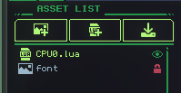

# Security Chip

The Security Chip has no methods or properties directly, but modifies how your gadget is allowed to be shared and inspected after publishing.

Adding it to your gadget will prevent users from duplicating it on the workshop.

Additionally, you will be able to select which assets are available for inspection. This allows you to, for example, keep your code open-source but hide your sprites. Or, you can hide Lua files with your level data (to prevent spoilers) but keep your engine open-source.

 

-----------------------------------------------------------------------------------------------------------
<small>Open source gadgets help the whole community learn. Please consider leaving code visible, or opting to forgo a Security Chip altogether. ❤️</small>