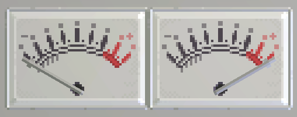

# Gauge


**The Gauge module's API is exposed as `AnalogGauge`.**

The Gauge is an aesthetic output device that roughly displays a fractional value.

**The needle has momentum and will ease and bounce to new values,** even when the gadget is turned off or initially turned on.

## Properties

### Value - `number`
A position from 0 to 100, with 0 being the very left side of the range (labeled - ) and 100 being the right side (labeled + )




## Examples

### Controlling a Gauge with a Knob
```lua
local gauge:AnalogGauge = gdt.Gauge0
local knob:Knob = gdt.Knob0

function update()
	gauge.Value = (knob.Value + 100) / 2
end
```
