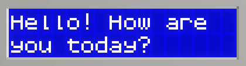

# Lcd


**The Lcd module's API is exposed as `LcdDisplay`.**

The Lcd can display a string of up to 32 characters, with a customizable foreground and background color.

The Lcd's display is 16x2. The **Lcd will not perform any word wrapping**, and will split words when moving to the next line.

## Properties

### Text - `string`
The text to display. It will be displayed starting at the top left and wrapping after 16 characters. Text that cannot fit will be clipped.
```lua
local display:LcdDisplay = gdt.Lcd0
display.Text = "Hello! How are  you today?"
--Extra space between are and you to avoid splitting word
```


#### Examples

You can use Lua's built-in function [`string.format`](https://www.lua.org/manual/5.3/manual.html#pdf-string.format) to organize each line independently from each other, assuming they both are no longer than 16 characters.

```lua
LCD.Text = string.format("%- 16s%- 16s",line1, line2)
```
If these lines can be longer, you can crop them either to keep the first or last characters : 
```lua
-- this will crop from the start of the string:
line1 = string.sub(line1, 1, 16)
-- this will crop from the end of the string:
line1 = string.sub(line1, math.max(1,string.len(line1)-15))
```

### BgColor - `color`
Background color for the Lcd.

### TextColor - `color`
The color for the displayed text.
