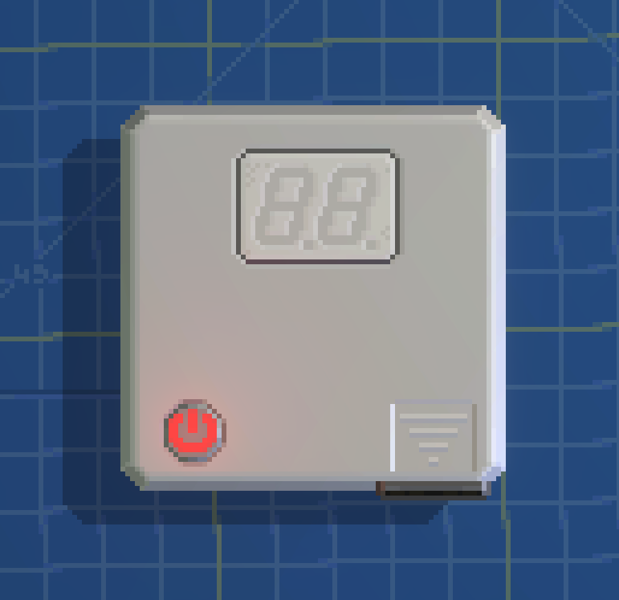
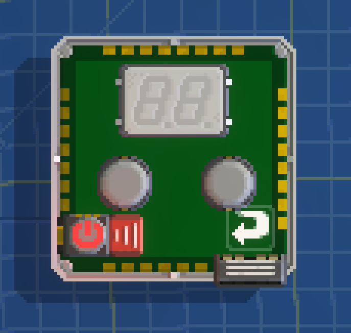
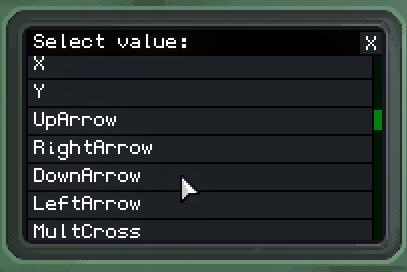
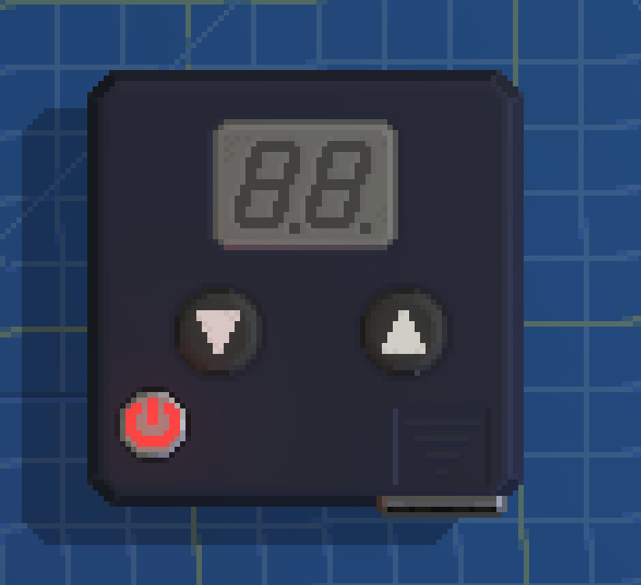
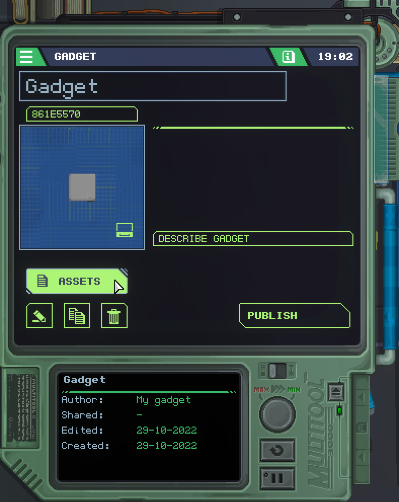

# Segment Display

Welcome, in this page, you will be learning how to display numbers 0-99 in a two [seven-segment display](../docs/modules/output/SegmentDisplay.md) component
and how we can manipulate those numbers using two [buttons](../docs/modules/input/LedButton.md).

Before we start, I want you to familiarize your self with the environment first [here](./getting-started.md).

## Building your gadget
First of all, go to the boards drawer and pick a shape:

Now go to the output drawer and scroll up until you find the displays section.  
Now pick the third one starting from above and put that anywhere on your device, make sure you have enough space for two buttons.

  

After that, go to the input drawer, pick two buttons you like and place that anywhere on your device.  
If you are following exactly what I'm doing then make sure to reposition the [power button](../docs/modules/misc/PowerButton.md) like the one on the first image below.

Now flip the board and go to the misc drawer, scroll up and you should find a "CPUs" section.  
Pick a CPU and place that on your gadget, this will allow us to [program](#programming-your-gadget) our gadget later.

Great, now we can decorate our gadget.

## Printing symbols on your components

Note that only certain components can have symbols printed onto them such as [LED buttons](../docs/modules/input/LedButton.md) and [switches](../docs/modules/input/Switch.md).

I'm just going to print a symbol on both buttons by opening the MultiTool and selecting the two buttons we just placed.

To print a symbol onto each button, first go to the symbol property below the hardware section and click on it.  
You will see a list of symbol names, scroll down and pick the one you like for each button.

I will pick `DownArrow` for the first button and `UpArrow` for the second button.

Awesome! Our buttons now have symbols, this will make it easier for people to understand which button does what.

## Painting your gadget

Did you know that we could also paint our gadget to make it look even cooler?  
Let's do that then!

On the bottom-right corner of your workstation, you will see an airbrush.  
Click on it and pick a color you want.

Note that left-clicking on a paint will change the color of your main paint while right-clicking will change the color of your secondary paint.

Left-clicking on a button will change its color while right-clicking will change the color of its symbol as shown in the image below.

As you can see in the image, my main color is dark gray while my secondary color is white.

I'll paint the seven-segment display dark gray and then paint the whole gadget black.

Beautiful! Now we can get to the fun part!

## Programming your gadget

First of all, go to your MultiTool and click on the "Assets" button.

Now double-click on the `CPU0.lua` file.

You should see this:

🚧 Under Construction! 🚧