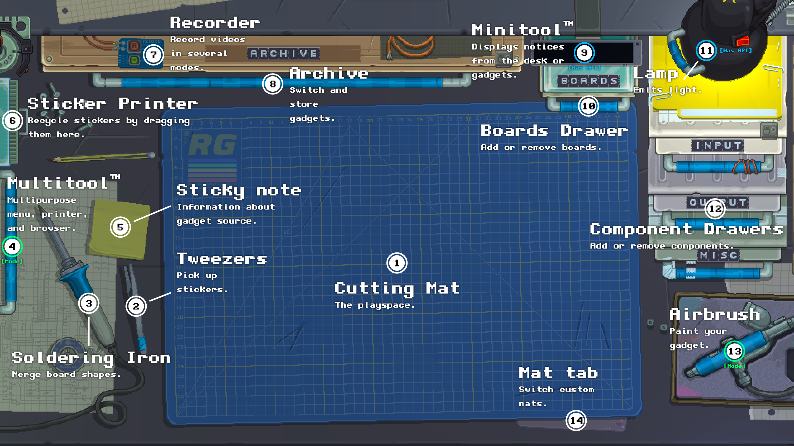
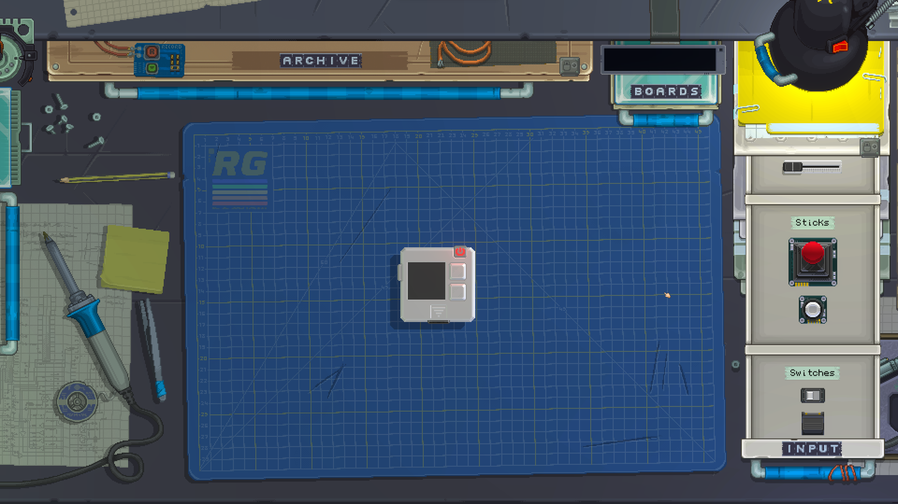
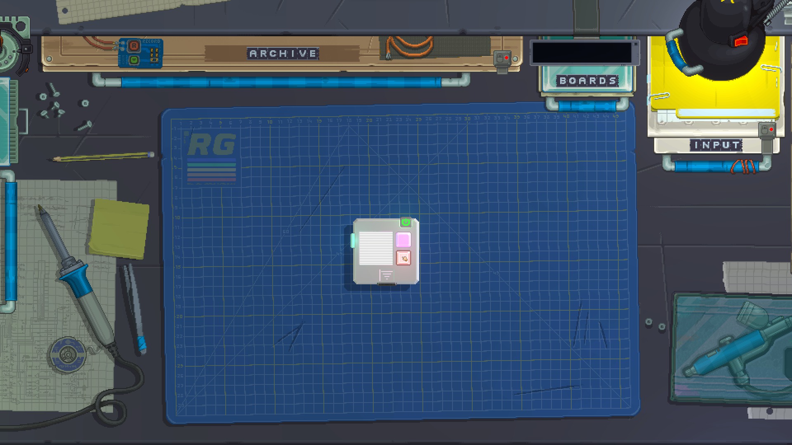
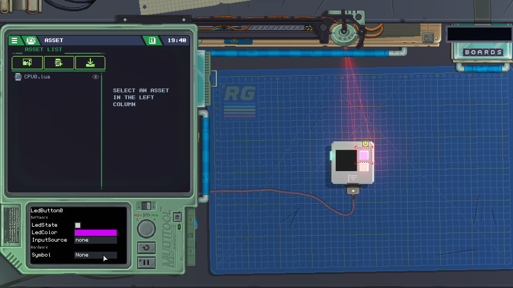
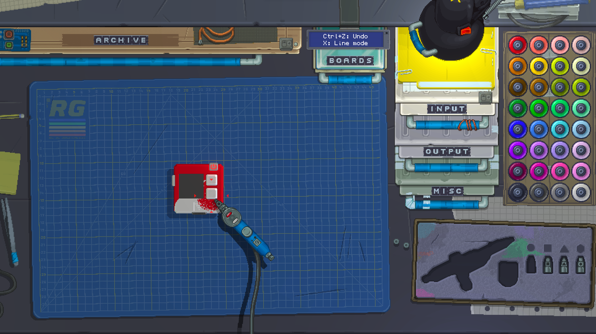

# Desk (Masa)

**Çevirmenden Not: Resimdeki yazıları çeviremedim. Alttaki yazılarda anlamlarını açıkladım.**

Masa, Retro Aygıtlardaki ana ortamdır ve aygıtlarınızı bir araya getirdiğiniz veya kullandığınız yerdir. **Görünürken, yakınlaştırmak için sol shift tuşunu basılı tutabilirsiniz.**

|     | İsim               | Açıklama                                                                                                                                                                                                                                                      |
| ---:| -----------------  | ----------------------------------------------------------------------------------------------------------------------------------------------------------------------------------------------------------------------------------------------------------    |
|   1 | Mat                | Ana oyun alanının görsel bir temsili. Gadget'lar üzerinde bulunur. Özel tasarımlar eklediyseniz Mat sekmesi `(14)` kullanarak tasarımı değiştirebilirsiniz.                                                                                                   |
|   2 | Cımbız             | Cımbız yerleştirilmiş çıkartmaları almak için kullanılır. Daha sonra yeniden düzenlenebilir veya kaldırılmak üzere Etiket Yazıcısına `(6)` sürüklenebilirler.                                                                                                 |
|   3 | Lehim Havyası      | Havya, Pano Çekmecesi `(10)`deki tahta parçalarını daha büyük şekiller halinde birleştirmek için kullanılır.                                                                                                                                                  |
|   4 | Multitool™         | Multitool, çok amaçlı bir menü, düzenleyici ve yazıcıdır. Varlıklarınızı bunun aracılığıyla kodlayabilir, çizebilir ve yönetebilirsiniz. Kolu sağa çekmek, kamerayı kaydırarak oluşturma modundan inceleme moduna geçer. Bu, başlangıçtaki varsayılan moddur. |
|   5 | Sticker Notu       | Yapışkan not, aktif gadget steam atölyesinden indirildiğinde bir simge görüntüler.                                                                                                                                                                            |
|   6 | Sticker Yazıcısı   | Etiket Yazıcısı etiketleri yazdırır, ancak Cımbız `(2)`den kendisine sürüklenen tüm yazıcıları geri dönüştürerek gadget'ınızdan kaldırır.                                                                                                                     |
|   7 | Kaydedici          | Kaydedici, tam ekran videolar veya gadget'larınız veya sosyal ağlarda paylaşmak üzere otomatik portre modunda videolar oluşturmak için kullanılır.                                                                                                            |
|   8 | Arşiv              | Arşiv, sisteminizde son kullanılana göre sıralanmış gadget'lar içerir. Etkin gadget'ı değiştirmek veya yeni bir gadget oluşturmak için mevcut gadget'ı kaldırmak için kullanılır.                                                                             |
|   9 | Minitool™          | Minitool, siz masanızı veya gadget'larınızı kullanırken bilgileri ve önemli bildirimleri görüntüleyen çağrı cihazı benzeri bir cihazdır.                                                                                                                      |
|  10 | Pano Çekmecesi     | Pano Çekmecesi, daha sonra Havya `(3)` ile birleştirilebilen bir araca pano eklemek için kullanılır. Bunlar, tüm gadget'ların temelini oluşturur.                                                                                                             |
|  11 | Lamba              | Lamba ışık yayar ve açılıp kapatılabilir. Bir gadget, Lambanın rengini veya geçiş durumunu ayarlayabilir.                                                                                                                                                     |
|  12 | Bileşen Çekmeceleri| Üç bileşen çekmecesi, araçlar oluşturmak için kullanılan Girdi, Çıktı ve Çeşitli bileşenleri içerir. Çeşitli çiplerin çoğu panoların arkasına yerleştirilebilir.                                                                                              |
|  13 | Pistole            | Pistole, gadget'larınızı boyamanıza olanak tanır. Sürüklemek, kamerayı kaydırarak çizim modunu etkinleştirir.                                                                                                                                                 |
|  14 | Mat sekmesi        | Mat sekmesi, etkin bir gadget olmadığında görünür ve özel paspaslar arasında geçiş yapmanızı sağlar.                                                                                                                                                          |

## Modlar

### Oluşturma (Build)
Oluşturma, Kesme Tahtasının ortalandığı ve tüm çekmecelere erişilebildiği varsayılan moddur. Bu modda bir gadget düzenlenebilir ve bileşenleri çekmecelere ve çekmecelerden sürükleyebilirsiniz.

### Oynayış
Oynaış moduna bir gadget üzerindeki güç düğmesine basılarak girilir. Bu sırada çekmeceler ve Airbrush kilitlenir, ancak Multitool inceleme moduna geçmek için hala kullanılabilir. Masayı kapatan alternatif bir oyun moduna "F11" tuşuna basılarak girilebilir. Gadget güç düğmesine tekrar basılarak kapatıldığında her iki oynatma modu da sona erer.

### İnceleme
İnceleme modu, bir gadget etkinken multitool açılarak etkinleştirilir. CPU yürütmesinde hata ayıklamak veya bileşenlerde özellikleri ve varsayılanları ayarlamak için kullanılabilir.

### Boyama/Çizim

Çizim modu, Pistole tutularak etkinleştirilir. Kamera, bir aygıtı ve bileşenlerini boyamak için seçilebilen (birincil/ikincil için hem sol hem de sağ tıklama ile renkler) bir palet ve boya kafalarını ortaya çıkarmak için yana kayar. Fare tekerleği boya boyutunu değiştirir ve Minitool ek kontroller görüntüler. Boya, çıkartmalardan geçmez ve şablon olarak kullanılmalarına izin verir.

## Metodlar

Gadget'lar masayı iki ana yerde kullanabilir.

### Lamba

#### desk.GetLampState() `boolean`
Lamba açıksa true değerini döndürür.

#### desk.SetLampState(state `boolean`)
Lamba durumunu, açık için true olan `state` olarak ayarlar.

#### desk.SetLampColor(color `color`)
Lambanın rengini herhangi bir renge ayarlar. **Oynayış modundan çıkıldığında beyaza sıfırlanır.**

### Minitool

#### desk.ShowMessage(message `string`, persistent `boolean`)
Minitool'da bir mesaj gösterir. Kalıcı doğruysa otomatik olarak temizlemez. Mavi bir arka plan kullanır.

#### desk.ShowWarning(message `string`, persistent `boolean`)
`ShowMessage` ile aynı, ancak arka planı sarı.

#### desk.ShowError(message `string`, persistent `boolean`)
`ShowMessage` ile aynı, ancak arka planı kırmızı.

#### desk.HideMessage()
Ekranı kapatarak Minitool mesajını silin.
