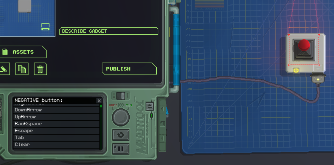

# KeyboardChip


KeyboardChip, bağlı bir klavyeden girdi almak için kullanılır. Etkileşimli bir şeye bağlandığında, bileşenin klavye aracılığıyla kontrol edilmesini sağlayabilir.

**_❔ Bu bileşen üzerinde hâlâ ayrıntılı olarak çalışılmaktadır._**

## Metodlar

<!-- TODO: Explain these methods. -->
### GetButton(name `InputName`) `InputSource`

### GetButtonAxis(name `InputName`) `InputSource`

## Event - `KeyboardChipEvent`
[CPU](./CPU.md) olay sisteminin bir parçası olarak yayılan olay.

Bir tuşa basıldığında veya bırakıldığında gönderilir.

### ButtonDown `boolean`
Bir düğme kapalıyken doğru
### ButtonUp `boolean`
Bir düğme serbest bırakıldığında doğrudur
### InputName `InputName`
Basılan/bırakılan tuşun adı

## Giriş Adları **[Sadece okuma]**
Giriş adlarına `KeyboardChip.`nameOfInput ile erişilebilir ve aşağıda listelenmiştir.
- `Return`
- `Space`
- `LeftArrow`
- `RightArrow`
- `DownArrow`
- `UpArrow`
- `Backspace`
- `Escape`
- `Tab`
- `Clear`
- `Pause`
- `Exclaim`
- `DoubleQuote`
- `Hash`
- `Dollar`
- `Percent`
- `Ampersand`
- `Quote`
- `LeftParen`
- `RightParen`
- `Asterisk`
- `Plus`
- `Comma`
- `Minus`
- `Period`
- `Slash`
- `Alpha0`
- `Alpha1`
- `Alpha2`
- `Alpha3`
- `Alpha4`
- `Alpha5`
- `Alpha6`
- `Alpha7`
- `Alpha8`
- `Alpha9`
- `Colon`
- `Semicolon`
- `Less`
- `Equals`
- `Greater`
- `Question`
- `At`
- `LeftBracket`
- `Backslash`
- `RightBracket`
- `Caret`
- `Underscore`
- `BackQuote`
- `A`
- `B`
- `C`
- `D`
- `E`
- `F`
- `G`
- `H`
- `I`
- `J`
- `K`
- `L`
- `M`
- `N`
- `O`
- `P`
- `Q`
- `R`
- `S`
- `T`
- `U`
- `V`
- `W`
- `X`
- `Y`
- `Z`
- `LeftCurlyBracket`
- `Pipe`
- `RightCurlyBracket`
- `Tilde`
- `Delete`
- `Keypad0`
- `Keypad1`
- `Keypad2`
- `Keypad3`
- `Keypad4`
- `Keypad5`
- `Keypad6`
- `Keypad7`
- `Keypad8`
- `Keypad9`
- `KeypadPeriod`
- `KeypadDivide`
- `KeypadMultiply`
- `KeypadMinus`
- `KeypadPlus`
- `KeypadEnter`
- `KeypadEquals`
- `Insert`
- `Home`
- `End`
- `PageUp`
- `PageDown`
- `F1`
- `F2`
- `F3`
- `F4`
- `F5`
- `F6`
- `F7`
- `F8`
- `F9`
- `F10`
- `F11`
- `F12`
- `F13`
- `F14`
- `F15`
- `Numlock`
- `CapsLock`
- `ScrollLock`
- `RightShift`
- `LeftShift`
- `RightControl`
- `LeftControl`
- `RightAlt`
- `LeftAlt`
- `RightCommand`
- `LeftCommand`
- `AltGr`
- `Help`
- `Print`
- `SysReq`
- `Break`
- `Menu`

## Notlar

### olay nasıl kullanılır
Klavye çipi, ilk başta anlamanız zor olabilecek [CPU](.CPU.md) olaylarından yararlanır. Aşağıda, şu anda basılmakta veya bırakılmakta olan anahtarın adının nasıl günlüğe kaydedileceğine ilişkin kısa bir öğretici yer almaktadır.

Öncelikle aygıtınıza bir klavye çipi ve bir CPU yerleştirin ve Multitool ile CPU'yu seçin:


Ardından, `EventChannels` öğesini seçin ve ilk kanalı klavye çipine ayarlayın.


Şimdi CPU'nuzun koduna gidin ve aşağıdaki işlevi ekleyin:

```lua
function eventChannel1(sender:KeyboardChip, arg:KeyboardChipEvent)
end
```
Küresel olması **gerektiğini** unutmayın! `local` anahtar sözcüğünün başına eklenmesi, CPU'nun bunu tanımasını engelleyecektir. Bu tür bir işlevin eklenmesi, kullanıcı bir tuşa bastığında veya bıraktığında CPU'nun otomatik olarak çalışmasına neden olur.

Şimdi, bir tuşa basılıp basılmadığını yazdırmak için fonksiyonun içine kodu ekleyin:

```lua
if arg.ButtonDown then
    log(tostring(arg.InputName) .. " is pressed")
elseif arg.ButtonUp then
    log(tostring(arg.InputName) .. " is not pressed anymore")
end
```


### Multitool ayarı

Bazen bileşenlere, koddaki karmaşıklıkları belirtmek zorunda kalmadan klavye çipinden doğrudan kontrol verilebilir.



Multitool'u kullanarak, bir klavye düğmesinin üzerinde hareket ettiği eksenleri nasıl değiştirdiğini kontrol edecek bir InputSourceX ve bir InputSourceY içeren Çubuklar gibi bileşenler sağlayabilirsiniz. Bir _NEGATIVE_ ve _POSITIVE_ girişi seçerken, çubuğu aşağı veya sola hareket ettiren NEGATİF olmalıdır; temelde olumsuz yönde. POZİTİF ise tam tersidir. S'yi NEGATİF'e ve W'yi POZİTİF'e eşleyerek, W (yukarı) ve S (aşağı) tuşlarıyla çubuğu yukarı ve aşağı hareket ettirebiliriz. Bu yöntem, KeyboardChip'in kendi yöntemleri aracılığıyla kodda kullanılan manuel tekniğin bir soyutlamasıdır ve genellikle çok daha kolay ve hızlıdır. Ancak ihtiyacınız olan genişletilebilirliği sağlamayabilir, çok sınırlı olabilir veya bir nesne için geçerli olmayabilir. Bu durumda, bunu bir Lua dosyasında manuel olarak yapmak daha iyi bir seçenektir.
