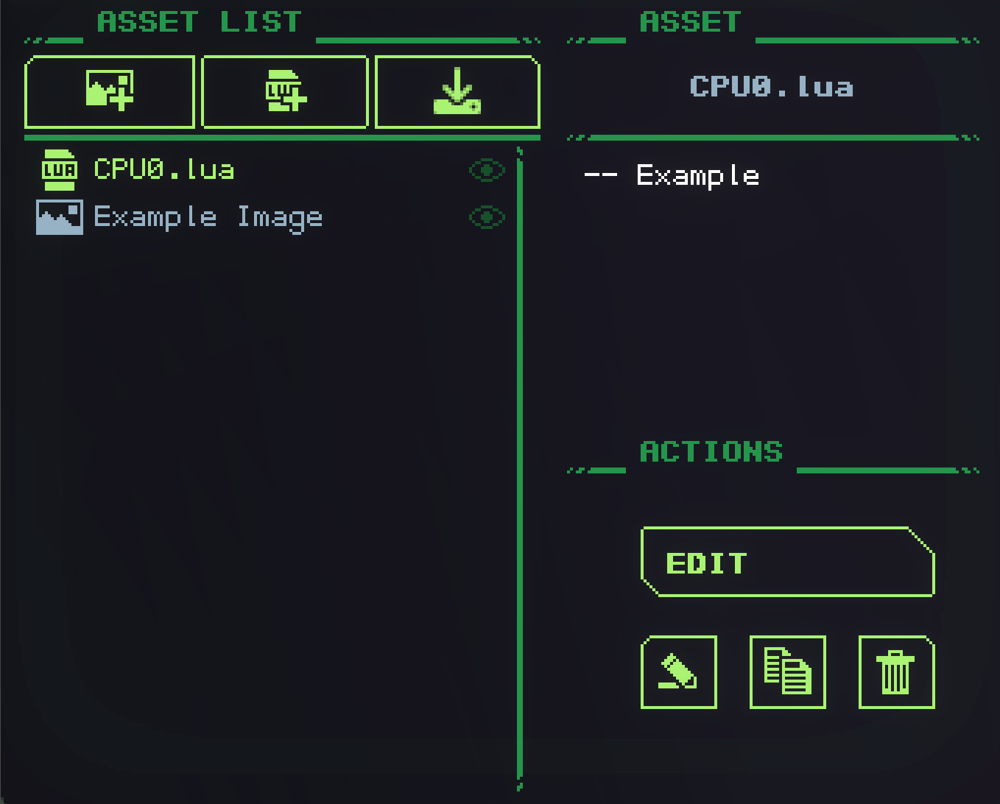

# ROM


Kullanıcı ve sistem varlıklarına erişmek için bir ROM kullanılır. Yerleşik varlıkların yanı sıra, varlıklar listesinden bir gadget'a yerleştirilen varlıkları içerir.

Öncelikle [VideoChip](./VideoChip.md) ve [AudioChip](./AudioChip.md) ile kullanılmak üzere görüntü ve ses yüklemek için kullanılır.

Bir gadget'ta yalnızca bir ROM olabilir. Beklendiği gibi, *Sadece okuma*.

## Kullanım
ROM'daki varlıklara, **ad alanı** ve ardından **veri türü** (çoğul) belirtilerek ve "{dize, (veri türü)}" döndürülerek erişilir. Örneğin:

```lua
---- All spritesheets
gdt.ROM.User.SpriteSheets
---- Get spritesheet named "font"
gdt.ROM.User.SpriteSheets.font
-- OR
gdt.ROM.User.SpriteSheets["font"]
```

**Kullanıcı** ad alanı, araca içe aktarılan dosyalara karşılık gelir. **varlık listesinde** görünen dosyalar şunlardır:



**Sistem** ad alanı, varsayılan yazı tipi gibi yerleşik dosyalara karşılık gelir.

ROM'u sorgulayabileceğiniz dört veri türü vardır:
- `Assets`: Türü ne olursa olsun yüklenen her varlık.
- `SpriteSheets`: [VideoChip](./VideoChip.md) ile kullanım için resimler.
- `Codes`: [CPU](./CPU.md) ile kullanım için Lua varlıkları.
- `AudioSamples`: [AudioChip](./AudioChip.md) ile kullanım için ses dosyaları.


<br>

-------------------------------------------------
<small>💡 ROM, salt okunur bellek anlamına gelir.</small>