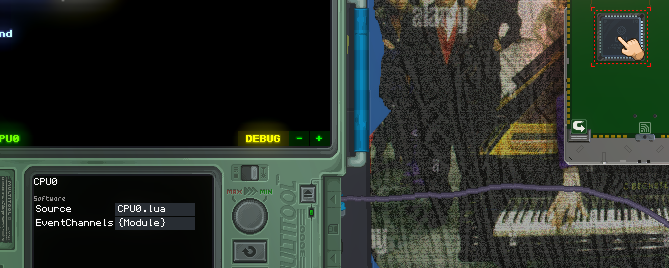
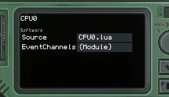

# Wifi


Wifi, internet dışında veri gönderip almanızı sağlayan bir çiptir. Yalnızca bir aygıtın kenarına yerleştirilebilir ve iki göstergesi vardır. Soldaki, bir şey yüklenirken etkinleşir ve sağdaki, bir şey indirilirken etkinleşir.

**⚠️ Bu sayfa eksik ve doğrulanmamış.**

## Özellikler

### AccessDenied `boolean`
Gadget'ın izinlerinin yanlış ayarlanması nedeniyle Wifi çipi çalışamadığında doğrudur. Bunu düzeltmek için gadget ayarları menünüze gidin, izinleri tıklayın ve ardından veri aktarımı ayarını açın.

## Metodlar
Çip tarafından gönderilen istekler, işleyicisini temsil eden ve daha sonra onu temsil etmek için kullanılabilecek bir `number` döndürür.

### WebGet(url `string`) `number`
Belirtilen URL'ye bir GET isteği gönderir.

### WebPutData(url `string`, data `string`) `number`
Belirtilen URL'ye bir PUT isteği gönderir.

### WebPostData(url `string`, data `string`) `number`
Belirtilen URL'ye bir POST isteği gönderir.

### WebPostForm(url `string`, form `{}`) `number`

### WebCustomRequest(url `string`, method `string`, customHeaderFields `{}`, contentType `string`, contentData `string`) `number`
`url`ye özel bir `method` isteği gönderir. Yalnızca HTTP'de yolunuzu biliyorsanız kullanılmalıdır.

### WebAbort(handle `number`) `boolean`
Çalışan tüm iletimleri iptal edin. `handle`, istek işlevleri tarafından döndürülen sayıdır. Daha sonra kontrol etmek isterseniz bunları bir değişkene kaydetmeniz gerekir.

```lua
local req = gdt.Wifi0:WebGet("http://example.com")
-- ...
gdt.Wifi0:WebAbort(req)
```

### GetWebUploadProgress(handle `number`) `number`
Belirtilen isteğin mevcut karşıya yükleme ilerlemesini 0'dan 100'e döndürür.

### GetWebDownloadProgress(handle `number`) `number`
Belirtilen isteğin mevcut indirme ilerlemesini 0'dan 100'e döndürür.

### ClearCookieCache()
Tüm web sitelerinden çerezleri temizleyin.

### ClearUrlCookieCache(url `string`)
Belirli bir web sitesinden çerezleri temizleyin.


## Event - `WifiWebResponseEvent`
[CPU](./CPU.md) olay sisteminin bir parçası olarak yayılan olay.

Bir web isteği tamamlandığında gönderilir.

⚠️ Bu bölüm daha fazla araştırma gerektirir.

### RequestHandle - `number`
### ResponseCode - `number`
İstek tarafından sağlanan [HTML yanıt kodu](https://developer.mozilla.org/en-US/docs/Web/HTTP/Status). İdeal olarak, `200`, "Tamam" olmalıdır.
### IsError - `boolean`
Bir hatayla karşılaşılırsa true değerini döndürür.
### ErrorType - `string`
### ErrorMessage - `string`
Bir hatayla karşılaşıldıysa, bilgilerini görüntüler.
### ContentType - `string`

Döndürülen bilgilerin [içerik türünü](https://developer.mozilla.org/en-US/docs/Web/HTTP/Headers/Content-Type) görüntüler. Örneğin, bir HTML belgesinin ContentType'ı "text/html" olacaktır.
### Text - `string`
Metin, tek bir dize olarak temsil edilen sonucun gövdesini içerir. Bunun ne anlama geldiği, sayfanın içerik türüne bağlı olacaktır. Normal bir HTML sayfası kaynağını döndürürken, RESTful API dizili JSON verilerini döndürür.


## Notlar

### Nasıl kullanılır
Wifi çipi, ilk başta anlamanız zor olabilecek [CPU](./CPU.md) olaylarından yararlanır. Aşağıda, basit bir GET isteğinin nasıl gönderileceğine ilişkin kısa bir eğitim yer almaktadır.

İlk olarak, gadget'ınıza bir Wifi çipi ve bir CPU yerleştirin ve Multitool'unuzla CPU'nuzu seçin:



Ardından, EventChannels'ı seçin ve ilk etkinlik kanalını Wifi çipiniz olarak ayarlayın.



Şimdi CPU'nuzun koduna gidin ve aşağıdaki işlevi ekleyin:

```lua
function eventChannel1(sender:Wifi, arg:WifiWebResponseEvent)
end
```

Küresel olması gerektiğini unutmayın! Yerel anahtar sözcüğün başına eklenmesi, CPU'nun bunu tanımasını engelleyecektir. Bu tür bir işlevin eklenmesi, ilk EventChannel'e tahsis edilen Wifi yongası bir isteği tamamladığında CPU'nun bu işlevi otomatik olarak çalıştırmasına neden olur.

Şimdi, isteği işlemek için işlevin içine kodu ekleyin. Döndürülen verilere erişmek için arg'yi kullanabilirsiniz. Örneğin, yanıt kodu 200 ise "OK" yazdırmak için, bunu fonksiyonunuza ekleyin:

```lua
if arg.ResponseCode == 200 then
  log("OK")
end
```