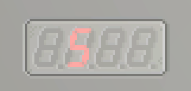

# SegmentDisplay


## Özellikler 

### States - `{{boolean}}`
Ekrandaki tüm Ledlerin açık/sönük durumunu haritalandıran bir tablo.

Aşağıdaki resimde gösterildiği gibi, ekranın üst kısmından başlayarak ekrandaki süreye kadar tablodaki her bir bölüme saat yönünde erişilebilir.


<!-- So if you wanted to display 2 for example, you would need to turn on 1, 2, 4, 5, and 7.

 -->

### Colors - `{{color}}`
Ekrandaki tüm Ledlerin rengini haritalayan bir tablo.


## Metodlar

### ShowDigit(groupIndex `number`, digit `number`)
Otomatik olarak bir rakam göster. Yalnızca 0-9 arasında görüntülenebilir ve **otomatik olarak daha büyük sayılar yazmaz.**

`groupIndex`, soldan 1'den başlayarak hangi basamağa yazılacağını belirlemek için daha büyük SegmentDisplay'lerde kullanılır.

```lua
gdt.SegmentDisplay0:ShowDigit(2,5)
```


### SetDigitColor(groupIndex `number`, color `color`)
`ShowDigit` gibi, ancak bir rakamdan sorumlu tüm segmentler için rengi ayarlayacaktır.