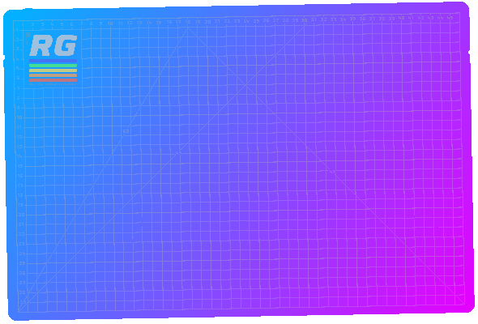
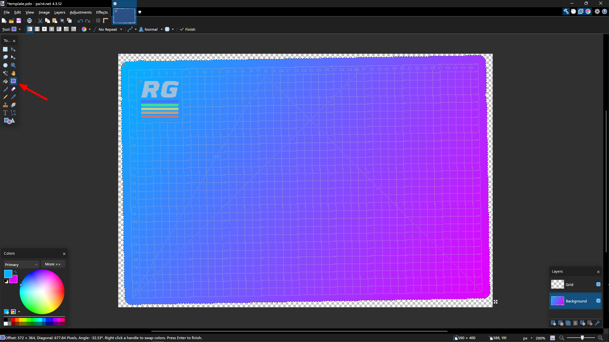
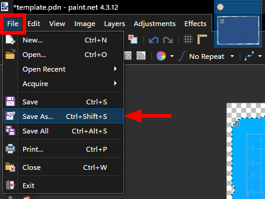
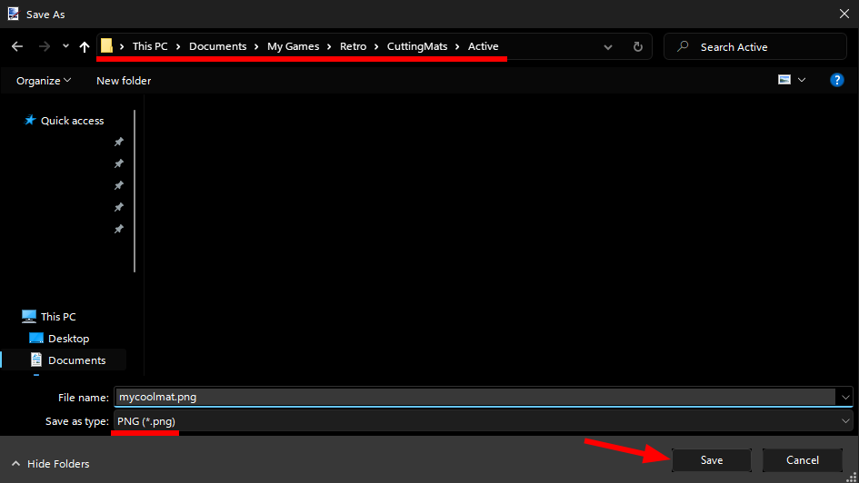
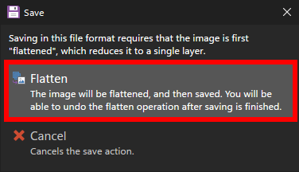
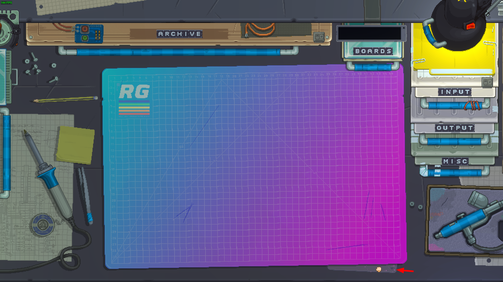

# Çalışma matı değiştirmeye giriş
Çalışma matı, gadget'larınızı oluşturduğunuz yerdir.
Halihazırda üzerinde herhangi bir alet(gadget) yokken, mevcut matınızın sağ alt köşesindeki mat sekmesine tıklayarak matlarınızı değiştirebilirsiniz.

Ayrıca kendi özel matlarınızı da yapabilirsiniz. Bu öğreticinin odaklandığı [Retro Desk](./../docs/desk.md)

## Eğitim
Bu eğitimde bu matı yapacağız:

Gimp, Photoshop ve Paint.NET için mat şablonunu buradan indirebilirsiniz:
- [Gimp](./../assets/examples/cutting-mat-tutorial/template.xcf)
- [Photoshop](./../assets/examples/cutting-mat-tutorial/template.psd)
- [Paint.NET](./../assets/examples/cutting-mat-tutorial/template.pdn)

### Başlarken

Öncelikle şablonu istediğiniz fotoğraf düzenleme yazılımında açın. (Ben [Paint.NET](https://www.getpaint.net/) kullanacağım ancak siz herhangi bir yazılım kullanabilirsiniz.)

Ardından, arka plan katmanında olduğunuzdan emin olun ve arka plan rengini seçmek için sihirli değneği kullanın(Yazılıma göre değişebilir):

Pick some nice colors and use the gradient tool to create a gradient across the mat:

When you're done, click `Save As...`:

Daha sonra dosya yöneticiniz ile `Documents > My Games > Retro > CuttingMats > Active` konumuna`.png` formatında kaydedin:

Bir sonraki ekranda `Tamam`a tıklayın ve resmi düzleştirmeyi seçin:

Son olarak, eğer çalışıyorsa oyununuzu yeniden başlatın ve aktif matlarınız arasında geçiş yapmak için mat sekmesine tıklayın:

Tebrikler! Kendi çalışma matınızı yaptınız ve onu başarıyla oyuna aktardınız!