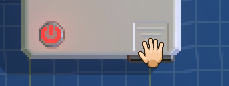
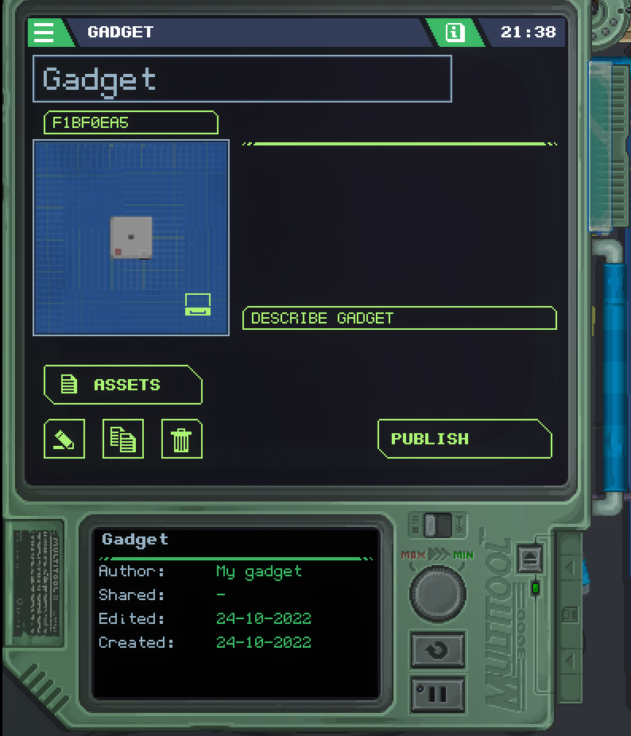

# Retro Masanıza Giriş
**Çevirmenden Not: Resimdeki yazıları çeviremedim. Alttaki yazılarda anlamlarını açıkladım.**
Retro Gadgets, bir Retro Masada geçiyor!
Retro Masanın **2 modu** vardır: MultiTool Modu ve Building Modu.

## Building Modu
<p align="center">
	
</p>

## Etkileşimli Nesneler

| Nesne İsmi             | Açıklama                                                                                                                          |
| :-------------------   | :-------------------------------------------------------------------------------------------------------------------------------- |
| 1. Kendi Gadgetin      | Gadget'iniz, masanızın ana cazibe merkezidir. Bu oyunda inşa etmeniz, test etmeniz ve oynamanız gereken şey bu.                   |
| 2. Mat                 | Burası sizin build alanınız, gadget'ınızla burada oynamaktan çekinmeyin!                                                          |
| 3. Pano Çekmecesi      | Gadget'ınızı oluşturmak için kullanabileceğiniz tüm panoları (temel şekiller) burada bulabilirsiniz.                              |
| 4. Bileşen Çekmeceleri | Burada her biri farklı bileşen türleri içeren 3 çekmece bulabilirsiniz.                                                           |
| 5. Lehim Havyası       | Gadget'ınızın kartlarını birbirine lehimlemek için havya kullanabilirsiniz.                                                       |
| 6. Pistole             | Biraz yaratıcı mı hissediyorsunuz, belki de havalı? (🍷) Gadget'ınızı istediğiniz gibi boyamak için Pistole kullanabilirsiniz..    |
| 7. Cımbız              | Gadget'ınıza çıkartma yerleştirmek veya yeniden konumlandırmak için cımbızı kullanabilirsiniz..                                   |
| 8. MultiTool Kolu      | İşlevselliği cihazınıza programlamak için kullanılan birincil aracınız! Buna daha sonra gireceğiz.                                |
| 9. Gadget Arşivi       | Bitmiş gadget'larınızı buraya koyabilirsiniz. Bitirmedin mi? Sorun değil! Başka bir şey üzerinde çalışın ve daha sonra geri dönün.|
| 10. Lamba              | Bu senin lamban, ortaya sola sürükleyip açıp kapatabilirsin.                                                                      |
| 11. Sticker Çöpü       | Çıkartmanızı buraya sürükleyin, silinecektir.                                                                                     |

<!-- 
TODO:
- [ ] Add a section on how to make the led blink
- [ ] Go in-depth with a couple of component examples
-->

# İlk gadget'ınızın kodlama dosyasını oluşturma
> Lütfen bunun bir Lua eğitimi olmadığını unutmayın. 
> [Lua Kılavuzunu](http://www.lua.org/pil/contents.html) buradan görüntüleyebilir veya [Learn X in Y minutes, Where X=Lua](https://learnxinyminutes.com/docs/lua/) konusundaki temel bilgilere göz atabilirsiniz.

Bir gadget oluşturmak ilk başta göz korkutucu bir görev gibi görünebilir, bu yüzden basit bir şey yapalım... ışığı açıp kapatan bir gadget!

## İlk Gadgetin
İlk temelimizi atalım. Pano çekmecesinden büyük bir kare tahta alıp gadget altlığının üzerine koyarak başlayalım.

İşiniz bittiğinde, bu kolu tutup yukarı çekerek gadget'ınızın kapağını çıkarın.:  


imdi, gadget tutamacının yanındaki ok simgesine tıklayarak tahtayı ters çevirelim. "Misc" etiketli çekmeceyi açın ve küçük bir CPU bulun, ardından kartın arka tarafına yerleştirin. Ters çevirin.


Şimdi bir ışık ekleyelim. "Output" etiketli çekmeceyi açın, bir LED ışığı bulun ve kartın herhangi bir yerine yerleştirin.

Artık kapağı panoya geri sürükleyerek geri koyabilirsiniz.

## Gadgetinizi Programlayın.
Şimdi asıl işe geldik! Gadget'ınızı oluşturduğunuza göre, onu programlama zamanı!
MultiTool'u açarak başlayalım: tutamacı sağa sürükleyin.

Gadget'ınızı büyük olasılıkla aşağıdaki şekilde göreceksiniz:  


"Assets" üzerine tıklayarak, ardından "CPU0.lua" üzerine çift tıklayarak CPU'nun Lua betiğini açalım.

Aşağıdakileri göreceksiniz:
```lua
-- Retro Gadgets

-- update function is repeated every time tick
function update()

end
```

Şu LED'i yakalım, olur mu? `gdt.` yazarak gadget'ınızın bileşenlerini görebilir ve bunlara erişebilirsiniz. Oradan, LED bileşeninizi seçin.
Tek bir LED seçtiyseniz, `State` özelliğini göreceksiniz, görmediyseniz geri dönün ve tek bir LED seçin. 
Aydınlatmak için "State" özelliğini true olarak ayarlayabilirsiniz:

```lua
-- Retro Gadgets
gdt.Led0.State = true

-- update function is repeated every time tick
function update()

end
```

Güç düğmesine tıklayarak gadget'ınızı açın ve LED'in yandığını görmelisiniz!